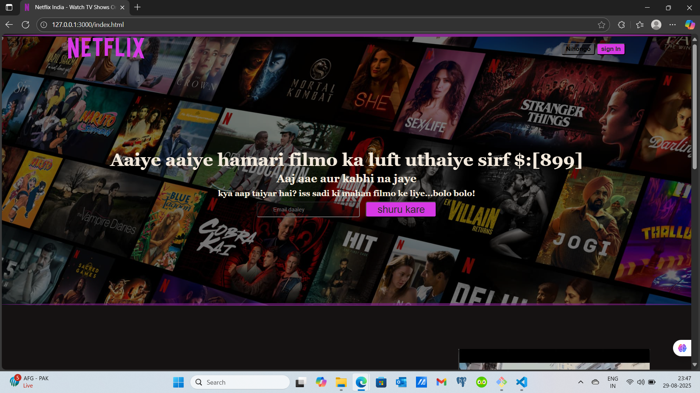

# 🎬 Netflix Clone  

A fully responsive **Netflix Clone** built with modern web technologies to replicate the look and feel of Netflix.  
This project showcases **UI/UX design, API integration, and front-end development skills**.  

---

## 📸 Preview  

---

## 📂 Project Structure
\`\`\`
Netflix clone/
 ├── public/            # Static assets  
 ├── src/               # Core source code  
 │   ├── components/    # Reusable UI components  
 │   ├── pages/         # Application pages  
 │   ├── hooks/         # Custom hooks  
 │   └── App.js         # Main application file  
 ├── package.json       # Dependencies & scripts  
 └── README.md          # Project documentation  
\`\`\`

---

## 🚀 Features
- 🎥 Browse movies and TV shows  
- 🔍 Search functionality  
- 📱 Fully responsive design  
- 🎨 Netflix-style UI/UX  
- ⚡ Optimized performance  

---

## 🛠️ Tech Stack
- **Frontend:** React.js / Next.js  
- **Styling:** Tailwind CSS / Styled Components  
- **API:** TMDb API (The Movie Database)  
- **Deployment:** Vercel / Netlify  

---

## 📌 How to Run
1. Clone or download this repo  
2. Install dependencies using \`npm install\`  
3. Run with \`npm start\`  
4. Open [http://localhost:3000](http://localhost:3000) in your browser  

---

## 🤝 Contribution
Contributions are welcome! Feel free to fork this repo, submit issues, or create pull requests.  

---

